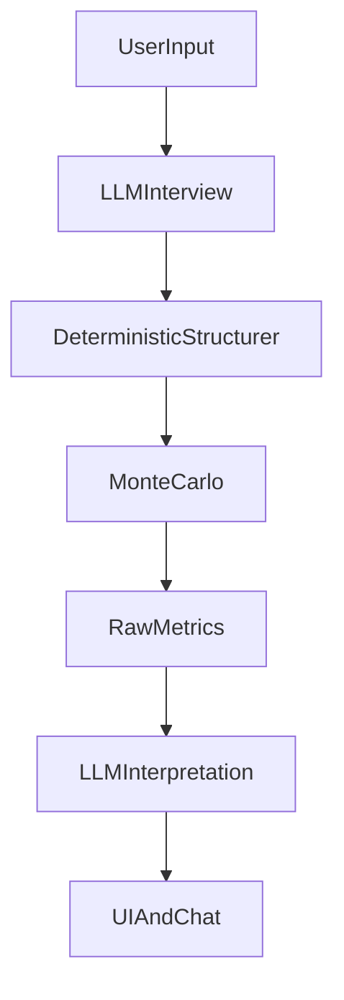

## Project Description: Regretless AI

### Overview
Regretless AI is a decision intelligence application that helps people make high-stakes choices by exploring **many plausible futures** instead of making a single “prediction.” It uses **Monte Carlo simulation** to generate outcome distributions and scenarios, then uses an **LLM as an interpreter** to translate those results into human-readable insights: trade-offs, scenario stories, regret paths, and safer next steps.

The product is designed for decisions where uncertainty and regret matter: education choices, career moves, major financial decisions, and personal life transitions.

### Core problem
Most decision tools fail in one of two ways:
- **Purely numerical tools**: output abstract scores that users can’t map to real consequences.
- **Pure LLM “advice bots”**: risk hallucinating numbers, probabilities, or confident predictions.

Regretless AI avoids both by splitting responsibilities cleanly.

### Responsible AI role split (key differentiator)
**Simulation = Brain (source of truth for numbers)**
- Generates the probabilities, scenario likelihoods, and score distributions.
- Computes regret and risk signals using explicit formulas and statistics.

**LLM = Voice + Judgment (meaning, not math)**
- Asks clarifying questions before simulation to reduce ambiguity.
- Interprets simulation outputs into consequences and narratives.
- Explains uncertainty in plain language.
- Frames “regret paths” using counterfactual reasoning.
- Applies safety/ethics gates for high-risk decisions.
- **Never invents numbers or overrides the simulation** (guardrails enforce this).

### What the user experiences (UX flow)
1. **Decision intake**: user describes a decision in natural language.
2. **Clarifying interview (LLM)**: short questions to gather runway, constraints, alternatives, stress vs strategy.
3. **Structured inputs (deterministic)**: qualitative factors are converted into distributions by code (not the LLM).
4. **Monte Carlo simulation**: thousands of simulations generate distributions and scenario buckets.
5. **Interpretation layer (LLM)**: converts results into:
   - decision readiness verdict
   - scenario “mini life stories”
   - key risks + mitigations
   - regret framing (“quit prepared vs quit impulsively”)
6. **Interactive exploration**: charts, counterfactuals (“what if I delay?”), explainability graph, chat discussion.

### Key features
- **Scenario cards**: Best / Most Likely / Worst outcomes with probability, timeline framing, and real-world consequences.
- **Human metrics**: interpretable dimensions (stability, financial safety, mental wellbeing, regret risk).
- **Regret Score**: a proprietary, explainable metric measuring expected downside regret (probability × loss × emotional cost).
- **Risk detector**: flags long-tail downside, high variance (instability), conflicting factors, and wellbeing risks.
- **Counterfactual Explorer**: identifies the smallest input shifts that move outcomes from worst → likely/best.
- **Explainability graph**: visualizes how inputs influence outcomes (variable → outcome relationships).
- **Safety gates**: for high-stakes domains, the assistant avoids absolutes, emphasizes preparation, and discourages impulsive action.
- **PDF export**: shareable, judge-friendly summary of the analysis.

### Architecture (high level)

### Tech stack
- **Frontend/UI**: Streamlit
- **Simulation**: NumPy-based Monte Carlo engine
- **Charts**: Plotly
- **Models/validation**: Pydantic
- **LLM**: Groq (chat completions)
- **Reporting**: ReportLab (PDF)

### Safety and anti-hallucination guarantees
Regretless AI enforces responsible LLM behavior through both prompting and code:
- **No invented numbers**: outputs are checked against allowed numeric tokens from simulation; extras are redacted.
- **No “fortune telling”**: LLM is framed as interpreter; simulation generates probabilities.
- **High-risk gating**: education/finance/health/legal/career decisions trigger preparation-first guidance.
- **User autonomy**: the system informs and helps reduce regret; it does not issue absolute directives.

### How to run locally
1. Install dependencies:
   - `pip install -r requirements.txt`
2. Set environment variables (PowerShell example):
   - `$env:GROQ_API_KEY="..."`  
   - `$env:GROQ_MODEL="llama-3.3-70b-versatile"` (optional)  
   - `$env:SIMULATION_COUNT="3000"` (optional)
3. Start the app:
   - `streamlit run app.py`

### Demo script (for judges)
1. Enter a short decision (e.g., “Can I quit studying?”).
2. Show the **LLM interviewer** asking 3–5 clarifying questions.
3. Run analysis; point out:
   - scenario probabilities come from simulation
   - readiness verdict + human metrics are interpretable
4. Click counterfactuals: “What reduces regret the most?”
5. Ask chat: “What regret looks like if I quit now vs prepare?”
6. Export PDF.

### Future improvements
- Better deterministic structuring heuristics per domain (education/immigration/health).
- “Future You” multi-horizon simulation summaries (6–12 / 12–18 / 18–36 months).
- Optional user-entered constraints as hard constraints (must-have / must-avoid).
- Automated evaluation harness for “no new numbers” compliance.

