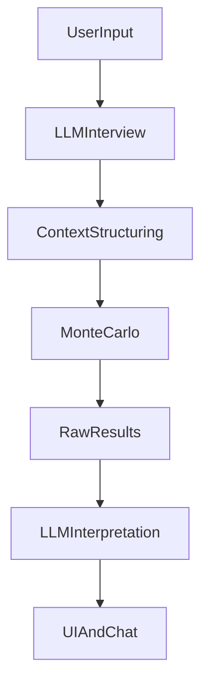

# 🧠 Regretless AI

**"Simulate Tomorrow. Decide Today."**

Regretless AI is a probabilistic decision simulator that helps you make better decisions by exploring multiple future scenarios. Instead of predicting the future, it shows you a range of plausible outcomes with confidence scores, regret analysis, and actionable insights.

## Responsible Role Split (Judge-Friendly)

**Simulation = Brain** (math + uncertainty)
- Monte Carlo simulation produces **all numeric outputs** (scores, distributions, probabilities).

**LLM = Voice + Judgment** (meaning + safety)
- Interviews for missing context (before simulation)
- Interprets simulation outputs into human meaning (after simulation)
- Surfaces trade-offs, regret paths, and actionable mitigations
- Challenges high-risk / irreversible decisions (no blind compliance)
- **Never invents numbers** or overrides simulation results

### 30-second judge pitch
Regretless AI separates reasoning from storytelling: we use Monte Carlo simulation to explore thousands of possible futures for a decision, then a Groq LLM interprets those results into understandable trade-offs, scenario stories, regret paths, and safer next steps—without generating or hallucinating numbers.

### Architecture diagram



## ✨ Key Features

### Core Functionality
- **Decision Intake (LLM Interviewer)**: Uses a Groq LLM to ask clarifying questions and structure context (no math)
- **Deterministic Structuring**: Converts qualitative factors into probability distributions via code (not the LLM)
- **Monte Carlo Simulation**: Runs 3,000+ simulations to explore possible outcomes
- **Scenario Analysis**: Identifies best case, worst case, and most likely scenarios
- **Risk Detection**: Automatically flags hidden risks and anomalies
- **Confidence Scoring**: Provides confidence levels based on outcome consistency
- **Human-Friendly Explanations**: Converts numeric results into clear, empathetic narratives

### 🏆 Competitive Features (Tier-1)

1. **Regret Score** - Proprietary metric measuring decision regret risk
   - Formula: Regret = Σ(Probability × Loss × Emotional Cost)
   - Color-coded interpretation (Low/Medium/High)
   - Provides clear decision signal

2. **Counterfactual Explorer** - Causal AI showing what would change outcomes
   - Identifies minimum variable changes needed to shift scenarios
   - Ranks variables by marginal impact
   - Shows "What if?" scenarios (Worst → Best, Worst → Likely, etc.)

3. **Decision Explainability Graph** - Visual causal graph
   - Interactive network graph showing variable→outcome relationships
   - Transparent, explainable AI visualization
   - Builds trust through transparency

### Enhanced Features

4. **Interactive Visualizations**
   - Distribution histograms of simulation outcomes
   - Scenario comparison radar charts
   - All metrics distribution overlays

5. **Actionable Recommendations**
   - LLM-generated specific next steps
   - Risk mitigation strategies
   - Prioritized action items

6. **PDF Report Export**
   - Professional PDF reports
   - Complete analysis summary
   - Shareable decision documentation

7. **Sensitivity Analysis**
   - Adjust variable weights in real-time
   - See impact on outcomes
   - Identify which variables matter most

8. **Conversational Chat Interface**
   - Discuss decisions with AI
   - Ask questions about results
   - Explore scenarios interactively

9. **Decision Comparison Service**
   - Compare multiple decisions side-by-side
   - Identify best overall, lowest risk options
   - Detect trade-offs

## Architecture

```
┌─────────────────────────────────────────────────────────────┐
│                    Streamlit Application                      │
│  ┌──────────────────────────────────────────────────────┐   │
│  │              UI Layer (Streamlit)                     │   │
│  │  • Decision Input Form                                │   │
│  │  • Scenario Cards Display                             │   │
│  │  • Interactive Visualizations                         │   │
│  │  • Counterfactual Explorer                            │   │
│  │  • Explainability Graph                               │   │
│  │  • Chat Interface                                     │   │
│  │  • Risk & Confidence Panels                           │   │
│  └──────────────────────────────────────────────────────┘   │
│  ┌──────────────────────────────────────────────────────┐   │
│  │           Service Layer (Python Modules)              │   │
│  │  • LLM Interviewer (Groq)                             │   │
│  │  • Deterministic Structurer (no LLM)                  │   │
│  │  • Causal Graph Builder                               │   │
│  │  • Monte Carlo Simulator                              │   │
│  │  • Risk Detector                                      │   │
│  │  • Regret Calculator                                  │   │
│  │  • Counterfactual Explorer                            │   │
│  │  • Explanation Generator (LLM)                        │   │
│  │  • Recommendation Service (LLM)                       │   │
│  │  • Chat Service (LLM)                                 │   │
│  │  • PDF Report Generator                               │   │
│  │  • Decision Comparator                                │   │
│  └──────────────────────────────────────────────────────┘   │
│  ┌──────────────────────────────────────────────────────┐   │
│  │         Simulation Engine (NumPy)                     │   │
│  │  • Probability Distributions                          │   │
│  │  • Scenario Sampling                                  │   │
│  │  • Outcome Aggregation                                │   │
│  └──────────────────────────────────────────────────────┘   │
└─────────────────────────────────────────────────────────────┘
```

## Installation

1. **Clone the repository**:
   ```bash
   git clone <repository-url>
   cd regretless-ai
   ```

2. **Install dependencies**:
   ```bash
   pip install -r requirements.txt
   ```

3. **Set up environment variables**:
   ```bash
   cp .env.example .env
   ```
   Edit `.env` and add your Groq API key:
   ```
   GROQ_API_KEY=your_api_key_here
   GROQ_MODEL=llama-3.3-70b-versatile
   SIMULATION_COUNT=3000
   ```

## Usage

### Local Development

Run the Streamlit app:
```bash
streamlit run app.py
```

The app will open in your browser at `http://localhost:8501`.

### Streamlit Cloud Deployment

1. Push your code to GitHub
2. Connect your repository to Streamlit Cloud
3. Add environment variables in the Streamlit Cloud dashboard:
   - `GROQ_API_KEY`: Your Groq API key
   - `GROQ_MODEL`: Optional model override
   - `SIMULATION_COUNT`: Number of simulations (default: 3000)

## How It Works

1. **Decision Input**: You describe your decision in natural language
   - Example: "Should I switch jobs from Company A to B?"

2. **Decision Intake (LLM Interviewer)**: the LLM asks clarifying questions and extracts qualitative factors
   - Output: *variable candidates* + missing context (no probabilities, no distributions)

3. **Deterministic Structuring (no LLM)**: code assigns probability distributions
   - Variables: salary_change, company_stability, work_life_balance, stress_level, etc.
   - Distributions: normal/beta/uniform/bernoulli are assigned by heuristics

4. **Causal Graph**: Maps variables to outcome dimensions
   - salary_change → financial_satisfaction
   - company_stability → job_security
   - stress → overall_satisfaction
   - etc.

5. **Monte Carlo Simulation**: Runs 3,000+ simulations (the only source of numbers/probabilities)
   - Samples from probability distributions
   - Computes outcomes using causal relationships
   - Generates outcome scores (satisfaction, financial, risk, overall)

6. **Scenario Extraction**: Identifies key scenarios
   - Best Case: Top 25% of simulations (highest combined score)
   - Worst Case: Bottom 25% of simulations (lowest combined score)
   - Most Likely: Middle 50% (most probable range)

7. **Regret Score Calculation**: Computes proprietary regret metric
   - Regret = Σ(Probability × Loss × Emotional Cost)
   - Measures expected emotional cost of worst-case scenarios
   - Provides clear decision signal (Low/Medium/High)

8. **Risk Detection**: Flags potential issues
   - High variance (unstable outcomes)
   - Long-tail downside risks
   - Conflicting factors
   - Extreme outliers
   - Financial-satisfaction mismatches

9. **Counterfactual Analysis**: Identifies what would change outcomes
   - Computes gradients (marginal impact per variable)
   - Ranks variables by impact
   - Shows minimum changes needed to shift scenarios

10. **LLM Interpretation Layer (Groq)**: converts simulation outputs into human meaning
   - Translates uncertainty into plain language
   - Writes scenario stories (without inventing numbers)
   - Explains regret paths using counterfactual reasoning
   - Generates actionable recommendations (risk/regret reducing)

11. **Visualization**: Interactive charts and graphs
    - Distribution histograms
    - Scenario comparison radar charts
    - Explainability causal graph
    - All metrics overlays

## Project Structure

```
regretless-ai/
├── app.py                      # Main Streamlit application
├── services/
│   ├── decision_parser.py     # LLM decision decomposition
│   ├── causal_graph.py        # Causal relationship builder
│   ├── simulator.py           # Monte Carlo engine
│   ├── risk_detector.py       # Risk analysis
│   ├── regret_calculator.py   # Regret Score calculation
│   ├── counterfactual_service.py  # Counterfactual Explorer
│   ├── explanation_generator.py  # LLM explanation
│   ├── recommendation_service.py  # Actionable recommendations
│   ├── chat_service.py        # Conversational interface
│   ├── report_generator.py    # PDF report generation
│   └── comparison_service.py  # Decision comparison
├── models/
│   ├── decision.py            # Decision Pydantic models
│   └── scenario.py            # Scenario result models
├── utils/
│   ├── visualizations.py      # Helper functions for charts
│   ├── charts.py              # Interactive Plotly charts
│   └── explainability_graph.py  # Causal graph visualization
├── requirements.txt
├── .env.example
├── .streamlit/
│   └── config.toml            # Streamlit configuration
└── README.md
```

## Dependencies

### Core Dependencies
- `streamlit>=1.28.0`: Web framework
- `numpy>=1.24.0`: Numerical computations and probability distributions
- `pydantic>=2.0.0`: Data validation and models
- `groq>=1.0.0`: Groq LLM API
- `python-dotenv>=1.0.0`: Environment variable management

### Visualization Dependencies
- `plotly>=5.17.0`: Interactive charts and graphs
- `pandas>=2.0.0`: Data manipulation and analysis

### Report Generation
- `reportlab>=4.0.0`: PDF report generation

## Features Overview

### 📊 Analysis Tabs

1. **Overview**: Scenarios, risks, and key metrics
2. **Visualizations**: Interactive charts and distributions
3. **Sensitivity**: Variable weight adjustments
4. **Counterfactuals**: What-if scenarios (Tier-1 feature)
5. **Explainability**: Causal graph visualization (Tier-1 feature)
6. **Recommendations**: Actionable next steps
7. **Discussion**: Conversational chat interface

### 🎯 Key Metrics

- **Confidence Score**: Outcome consistency across simulations (0-1)
- **Regret Score**: Proprietary metric for decision regret risk (0-1)
  - Low (0-0.3): Low risk of regretting decision
  - Medium (0.3-0.6): Moderate risk
  - High (0.6-1.0): High risk - reconsider decision
- **Simulation Count**: Number of Monte Carlo iterations
- **Risks Detected**: Number of hidden risks identified

## Example Decision Types

- **Job**: Career moves, job switches, promotions
- **Rent**: Housing decisions, location choices
- **Hiring**: Team expansion, recruitment decisions
- **Custom**: Any decision you want to analyze

## Key Concepts

- **Probabilistic Simulation**: Not predicting the future, but exploring possible futures
- **Causal Reasoning**: Understanding how variables affect outcomes
- **Monte Carlo Method**: Statistical simulation using random sampling
- **Confidence Scoring**: Measuring how consistent outcomes are across simulations
- **Regret Minimization**: Using proprietary regret score to minimize decision regret
- **Counterfactual Analysis**: Exploring "what if" scenarios to understand causality
- **Explainable AI**: Transparent visualization of decision mechanics
- **Risk Awareness**: Identifying hidden risks before they materialize

## Competitive Advantages

### 🔥 Tier-1 Differentiators

1. **Regret Score**: Original, proprietary metric that's brandable and memorable
2. **Counterfactual Explorer**: Causal AI showing actionable insights
3. **Explainability Graph**: Transparent, trust-building visualization

### 🎨 User Experience

- Interactive visualizations (Plotly charts)
- Conversational AI interface
- Professional PDF reports
- Real-time sensitivity analysis
- Actionable recommendations

### 🧠 AI-Powered Features (Responsible Role Split)

- LLM interviewer + interpretation (Groq)
- Deterministic structuring for simulation inputs (no LLM probabilities)
- Simulation engine as the source of truth for numbers

## Philosophy

> "Regretless AI doesn't tell users what to do — it shows them what could happen."
> 
> "We combine probabilistic simulation with human-centered explanations."

## License

[Add your license here]

## Contributing

[Add contribution guidelines here]

## Support

[Add support information here]

## Acknowledgments

Built with:
- [Streamlit](https://streamlit.io/) - Web application framework
- [Groq](https://console.groq.com/) - LLM API
- [Plotly](https://plotly.com/python/) - Interactive visualizations
- [NumPy](https://numpy.org/) - Numerical computing
- [Pydantic](https://docs.pydantic.dev/) - Data validation
